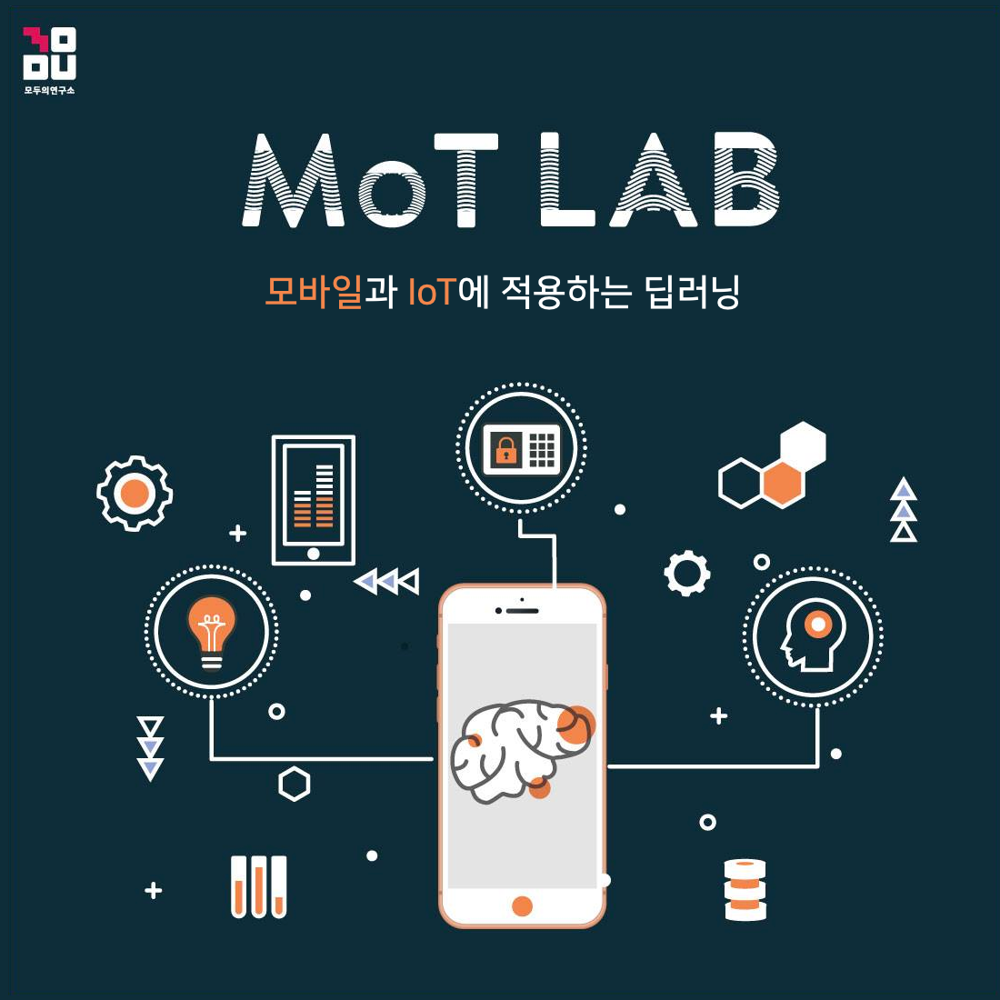

## Tensorflow Dev Summit Extended Seoul - ML Kit Codelabs

### 주제 : ML Kit 얼굴 감지 비전 모델을 응용한 토이 앱 Let's Smile 만들기

#### [코드랩 가이드 링크 바로가기](https://gdg-mlkit-codelabs.firebaseapp.com/)

### 브랜치 순서

- feature/settings
- feature/preprocessing
- feature/mlkit
- feature/lottie