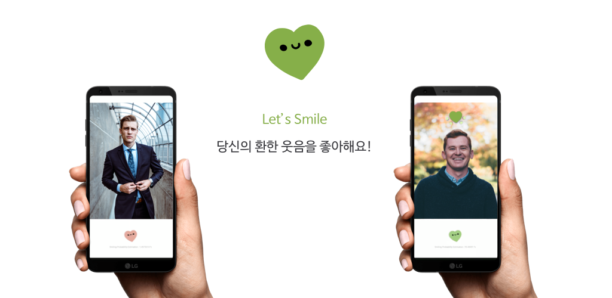

## Tensorflow Dev Summit Extended Seoul - ML Kit Codelabs

### 주제 : ML Kit 얼굴 감지 비전 모델을 응용한 토이 앱 Let's Smile 만들기

#### [코드랩 가이드 링크 바로가기](https://gdg-mlkit-codelabs.firebaseapp.com/)

Let’s Smile 은 카메라 프리뷰 위에 사용자 얼굴을 인식하여 사용자의 얼굴 위치와 Smiling Probability (웃고 있을 확률)을 감지합니다. 웃음을 감지하면 머리 위에 귀여운 Lottie 애니메이션을 송출합니다.

[Google Play Store 다운로드](https://play.google.com/store/apps/details?id=jeongari.com.lusmile)

 

### 브랜치 순서

- feature/settings
- feature/preprocessing
- feature/mlkit
- feature/lottie
